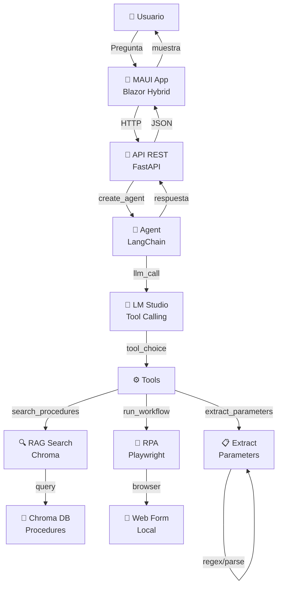

# Practica RPA + RAG + LangChain/LangGraph + MAUI

Proyecto organizado como monorepo para entregar la practica completa.

## Estructura

```text
Practica-RPA-RAG-MAUI/
|-- rpa_agent_project/   # Backend Python: RPA, LangChain, RAG, Chroma y API
|-- maui_app/            # Aplicacion MAUI Blazor Hybrid
|-- README.md            # Guia general
|-- .gitignore
```

## Arquitectura



## 1. Backend Python

```powershell
cd rpa_agent_project
python -m venv venv
.\venv\Scripts\activate
pip install -r requirements.txt
python -m playwright install chromium
if (!(Test-Path .env)) { Copy-Item .env.example .env }
```

Antes de usar el agente, indexa los procedimientos:

```powershell
python rag\index_procedures.py
```

## 2. LM Studio

Abre LM Studio y deja un modelo de chat cargado con servidor compatible con OpenAI en:

```text
http://localhost:1234/v1
```

El modelo debe soportar tool calling para que el agente pueda llamar a las tools. No basta con tener cargado solo un modelo de embeddings como `text-embedding-nomic-embed-text-v1.5`.

Puedes comprobar que el servidor responde con:

```powershell
Invoke-WebRequest http://localhost:1234/v1/models
```

## 3. Eleccion LangChain vs LangGraph

El backend usa `langchain.agents.create_agent` como API principal del agente porque encaja con el requisito base de LangChain 1.x y evita cablear manualmente el flujo RAG -> extraccion -> RPA. La decision de llamar a `search_procedures`, `extract_parameters`, `run_workflow` o `list_procedures` queda en manos del modelo mediante tool calling.

Aunque se usa la API de LangChain, `create_agent` en LangChain 1.x compila el agente como un grafo de LangGraph. En este proyecto se comprueba como `CompiledStateGraph` y se configura con `MemorySaver` y `thread_id` para conservar el estado de chat multi-turno.

La opcion de implementar un `StateGraph` propio de LangGraph tendria sentido para una version ampliada con nodos explicitos de validacion, confirmacion humana antes de ejecutar el RPA, gestion de errores y varios workflows. Para esta entrega se prioriza una solucion base clara con tools tipadas y trazas visibles, manteniendo LangGraph como runtime y memoria del agente.

## 4. Trazas del Agente

El agente proporciona trazas visibles en múltiples niveles:

### Logs en Terminal (API)

Cuando ejecutas `python api.py`, verás:

```
INFO: Started server process
INFO: Uvicorn running on http://127.0.0.1:8000
...
Agent input: {user_message}
Tool calls: [search_procedures, extract_parameters, run_workflow]
Agent output: {final_response}
```

### Configuración de Logging

En `agent/agent.py` se configura el nivel de detalle:

```python
import logging
logging.basicConfig(level=logging.INFO)
agent_logger = logging.getLogger("agent")
```

Niveles disponibles:
- `DEBUG`: Traza completa de tool_input, tool_output, estado intermedio
- `INFO`: Decisiones del agente, tools llamadas, resultado final
- `WARNING`: Errores recuperables, fallback a alternativa
- `ERROR`: Errores fatales que abortan la ejecución

### Seguimiento en LangGraph

El agente se ejecuta como `CompiledStateGraph` con `MemorySaver`. Puedes inspeccionar el historial completo:

```python
# En debug, accede al estado:
state = agent_executor.get_state(thread_id="user_123")
print(state["values"]["messages"])  # Todo el historial
```

### Visualización en Frontend (MAUI)

La app muestra en tiempo real:
- ✅ Procedimiento encontrado
- 📋 Parámetros extraídos
- ⏳ Ejecución RPA en progreso
- ✔️ Resultado final o error

### Tip para Debugging

Para ver **TODAS** las trazas del agente:

```powershell
cd rpa_agent_project
$env:PYTHONUNBUFFERED=1
$env:LANGCHAIN_DEBUG=1
.\venv\Scripts\activate
python api.py
```

`LANGCHAIN_DEBUG=1` activa trazas internas de LangChain/LangGraph mostrando cada paso.

## 5. Orden de arranque

Usa terminales separadas para mantener vivos los servicios:

Terminal 1: LM Studio

```text
Servidor OpenAI-compatible en http://localhost:1234/v1 con un modelo de chat/tool-calling cargado.
```

Terminal 2: formulario web local

```powershell
cd rpa_agent_project
.\venv\Scripts\activate
python web_form\server.py
```

El formulario queda en:

```text
http://localhost:8081
```

Terminal 3: API Python

```powershell
cd rpa_agent_project
.\venv\Scripts\activate
python api.py
```

La API queda en:

```text
http://127.0.0.1:8000
```

Puedes comprobarla con:

```powershell
Invoke-WebRequest http://127.0.0.1:8000/health
```

Terminal 4: aplicacion MAUI

```powershell
cd maui_app
dotnet build .\RPAChat.App\RPAChat.App.csproj -t:Run -f net9.0-windows10.0.19041.0
```

La app llama a la API Python en:

```text
http://127.0.0.1:8000
```

## 6. Demo

Mensaje de prueba:

```text
Dame de alta un producto: Camiseta Negra Roma, precio 19.99, stock 25, categoria camisetas
```

El flujo esperado es:

1. El agente busca el procedimiento con RAG.
2. Extrae los parametros del texto.
3. Ejecuta el workflow RPA.
4. El formulario muestra el mensaje de guardado.

## Notas para GitHub

No se suben archivos locales como `.env`, `venv`, `bin`, `obj` ni la base generada de Chroma. Si otra persona clona el proyecto, debe crear su propio `.env` copiando `.env.example`.
